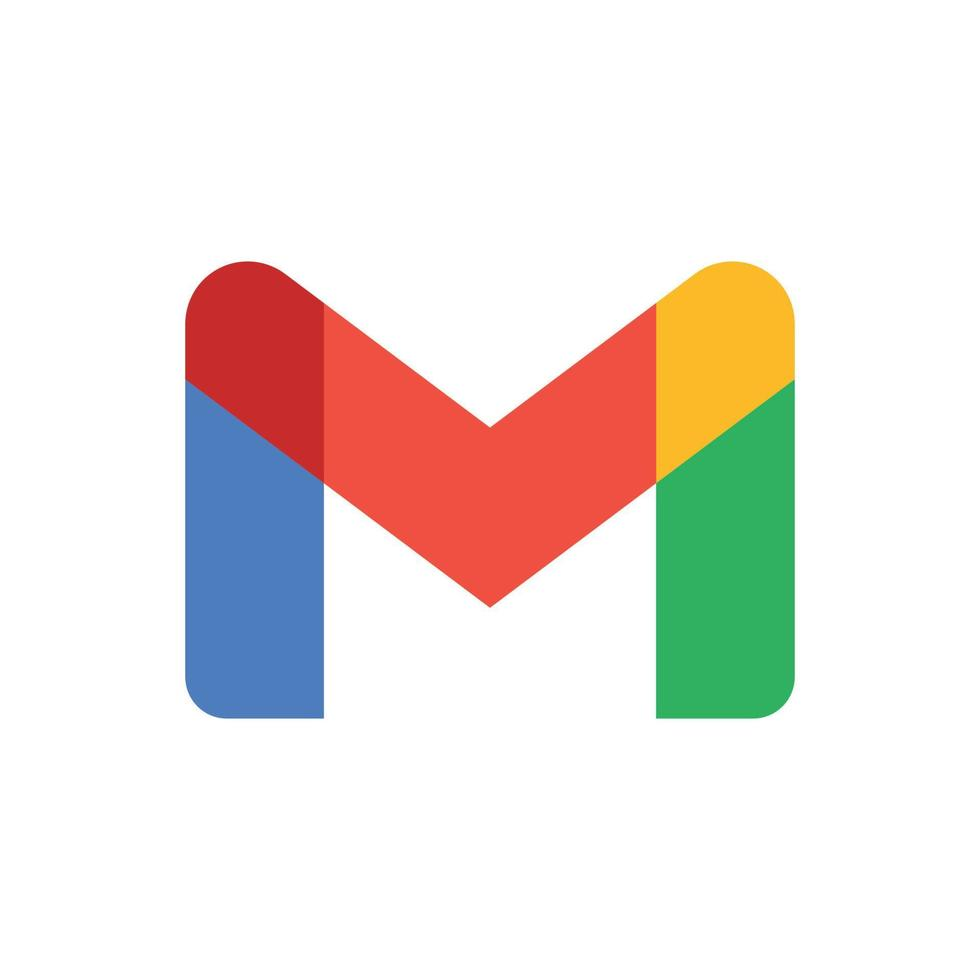
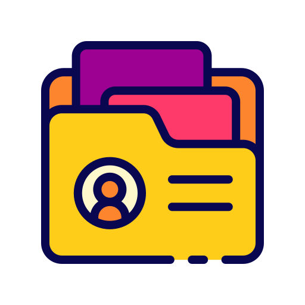

## Hi there, I'm Rajasi! (_^\_^_)

<!-- <video width="600" controls>
  <source src="assets/images/Cat-coding.mp4" type="video/mp4">
  Your browser does not support the video tag.
</video> -->

  
  
I'm a Software Engineer who loves understanding how humans think, learn, and function — picking apart the brain to understand what makes us human, and then translating those insights into software that can help people.

  
My interests sit at the intersection of software engineering, neuroscience, and human behavior. I enjoy building technology that isn't just functional, but meaningful and useful to the people who interact with it. I have experience building and supporting production applications, with a focus on Java, Spring Boot, SQL, backend development, and full-stack applications.

<!-- Here is my portfolio - [Portfolio Link](https://rajasi-desai.github.io/)  -->

> **Currently (Sep 2026) looking for full time positions for Full Stack or Frontend Software Engineer roles!**

✨ Fun fact: I have a dual degree in Computer Science and Psychology!

💬 I would love to hear from you! Feel free to reach out through email or connect with me on LinkedIn.

<!-- 
 <a href="rajasi.desai18@gmail.com"> rajasi.desai18@gmail.com </a>

 <a href="https://www.linkedin.com/in/rajasi-desai"> https://www.linkedin.com/in/rajasi-desai </a>

 <a href="rajasi.desai18@gmail.com"> rajasi.desai18@gmail.com </a>

[https://www.linkedin.com/in/rajasi-desai](https://www.linkedin.com/in/rajasi-desai)
[https://github.com/Rajasi-Desai](https://github.com/Rajasi-Desai)   -->

    
    
     

### Employer?

> [!IMPORTANT]  
> <a href="https://drive.google.com/file/d/1YbeLjPbiKJdK98ENu2LIOdCO6GJDX1WL/view?usp=sharing" download>Download my resume</a>

Last updated September 2026 

<!--
**Rajasi-Desai/Rajasi-Desai** is a ✨ _special_ ✨ repository because its `README.md` (this file) appears on your GitHub profile.

Here are some ideas to get you started:

- 🔭 I’m currently working on ...
- 🌱 I’m currently learning ...
- 👯 I’m looking to collaborate on ...
- 🤔 I’m looking for help with ...
- 💬 Ask me about ...
- 📫 How to reach me: ...
- 😄 Pronouns: ...
- ⚡ Fun fact: ...
-->
